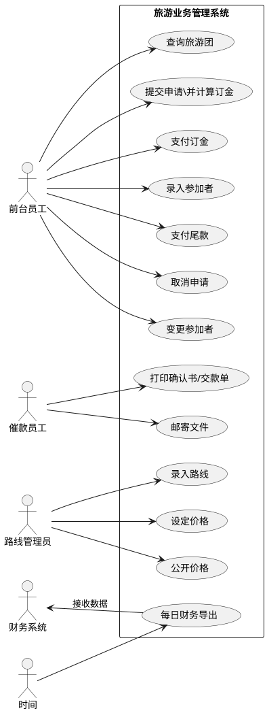
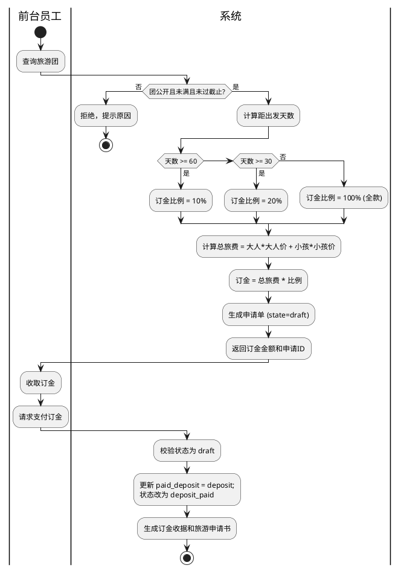
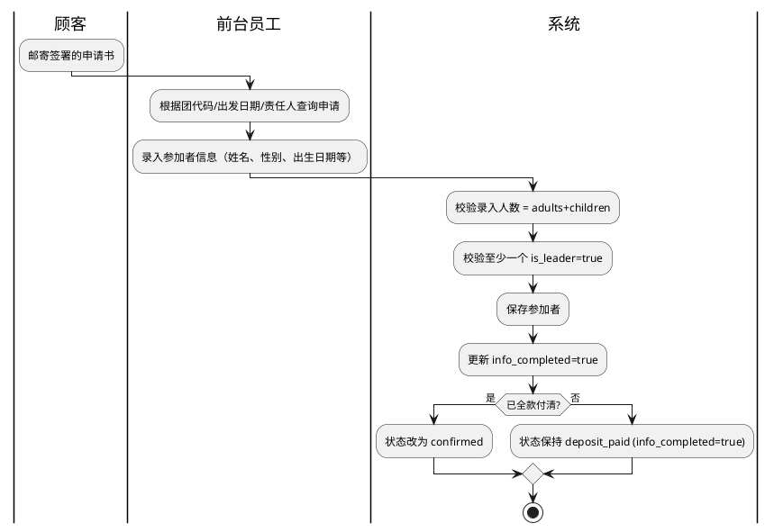
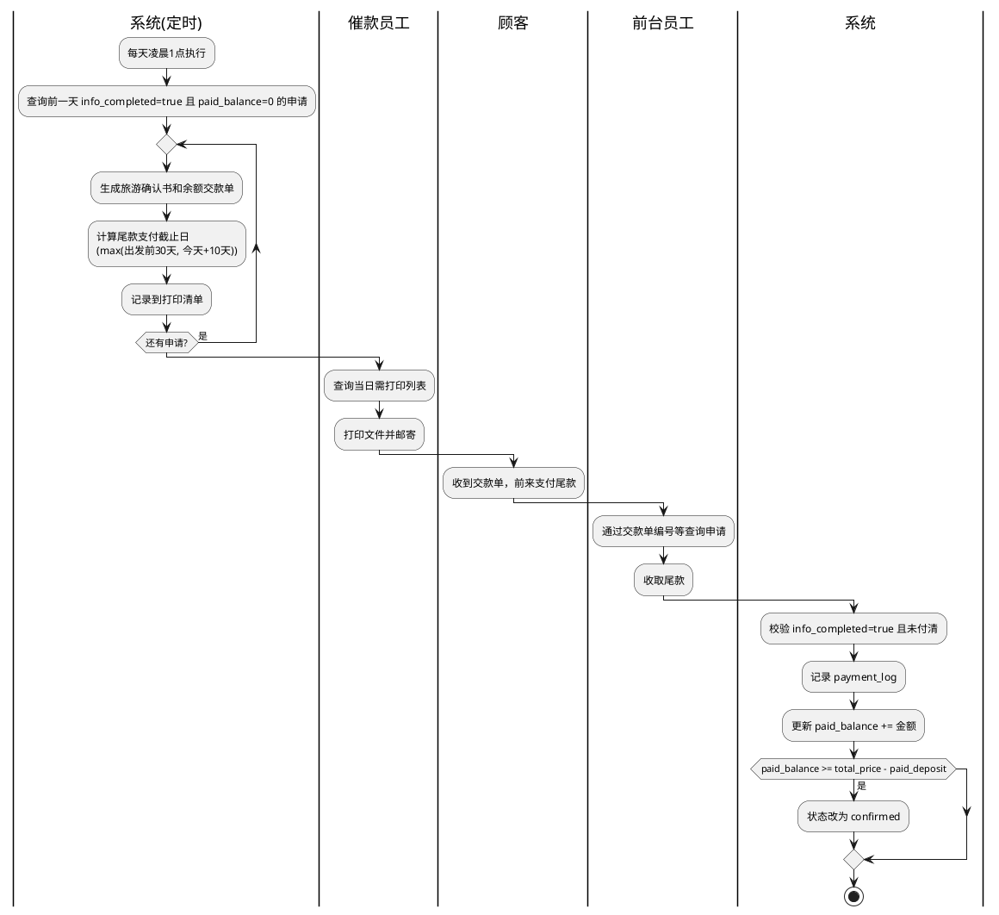
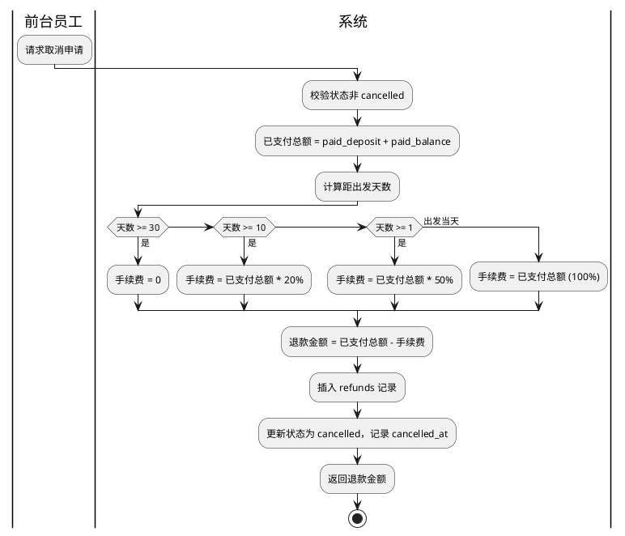
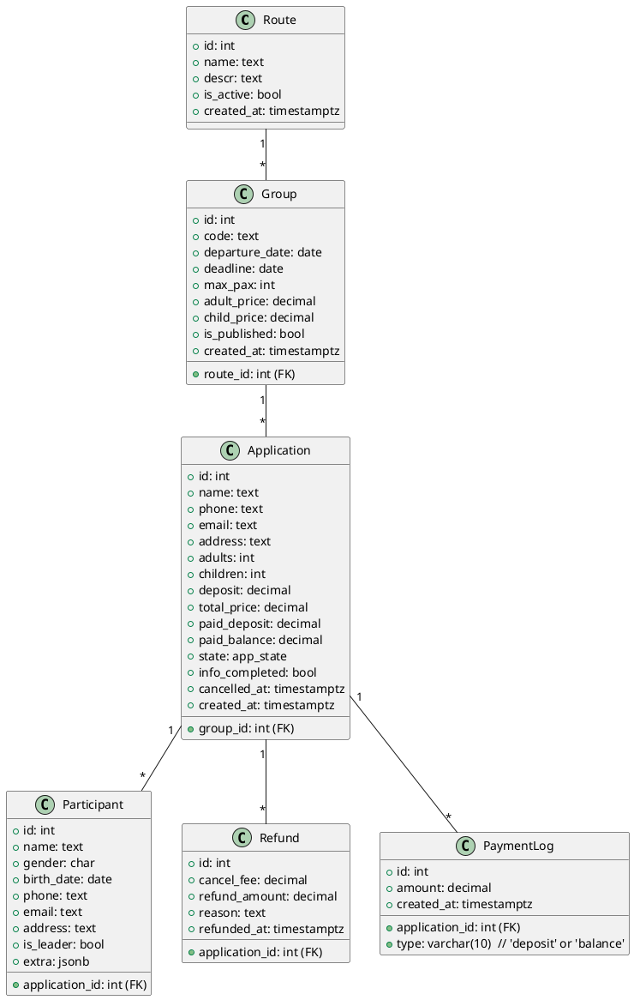
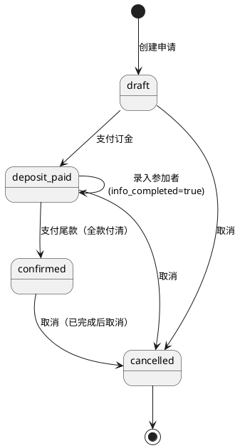
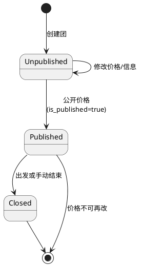

# 实例化

## 需求实例化——从需求书到结构化规格

在 SDD 中，**需求实例化**不是简单地把文字需求拆成用户故事，而是通过**软件工程的需求分析方法**，将模糊的自然语言转化为**无歧义的、可视化的、可验证的模型**。这些模型将成为第二阶段编写 Gherkin Feature 文件的直接输入，从而保证规范与业务逻辑严格一致。

以下是针对《旅游业务管理系统》第一阶段的具体实施方案，包含**必需的 UML 图**、**绘制思路**以及**如何向 Gherkin 过渡**。

### 1. 需求实例化的四步法

| 步骤 | 分析重点 | 主要 UML 图 | 产出作用 |
|------|---------|-------------|----------|
| 1.1 语境与角色分析 | 谁用系统？他们做什么？ | **用例图** | 划分系统边界，明确核心用例 |
| 1.2 业务流程建模 | 核心业务端到端的流转 | **活动图**（泳道图） | 理清操作顺序、分支规则、角色协作 |
| 1.3 领域概念建模 | 核心业务实体及关系 | **类图（领域模型）** | 定义实体、属性、关联，指导 Gherkin 中的 Given 数据 |
| 1.4 关键对象状态分析 | 重要对象的生命周期 | **状态图** | 描述申请、支付等的状态变迁，直接对应 Then 的验证点 |

这些图绘制完成后，可以自然地提炼出**用户故事**和**场景实例表**，为编写 `.feature` 文件提供精确的输入。

---

### 2. 四类 UML 图的详细绘制指南

#### 1.1 用例图 —— 角色与功能全景

**目的**：清晰定义系统边界、执行者及其目标。这是防止需求蔓延的第一道防线。

**执行者（Actor）**：
- 前台员工（接待顾客、办理申请、录入参加者、收款、变更/取消）
- 催款员工（打印确认书/交款单、邮寄）
- 路线管理员（设计路线、设定价格、录入活动）
- 财务系统（外部系统，接收导出数据）
- 时间（触发自动导出）

**核心用例（建议分组）**：
- 申请管理：查询旅游团、提交申请、计算订金、录入参加者、完成申请
- 支付管理：收取订金/余款、打印确认书与交款单、导出财务数据
- 变更管理：变更参加者、取消申请（含手续费计算）
- 路线与定价管理：录入新路线、设定/调整价格、查看路线历史
- 自动任务：每天晚上导出当日交易

**图的结构**：一个系统边界框，多个执行者在左侧，用例在框内，连接关系标注 `<include>`、`<extend>`（如“计算订金”被“提交申请”包含）。

**向 Gherkin 的过渡**：每个用例都是一个 Feature 的候选，用例名称可直接作为 `Feature:` 的标题。

---

#### 1.2 活动图（泳道图）—— 业务流程的可视化规则

**目的**：把需求书中隐含的分支、循环、并发和角色责任完全显性化。这是 SDD 中最关键的建模，因为 Gherkin 的 `When/Then` 本质上就是在描绘活动的路径。

**需要绘制的核心流程**（至少 4 个）：
1. **旅游申请与订金收取流程**（泳道：顾客、前台员工、系统）
   - 分支：团是否有效？人数是否满？距出发日期多久（决定订金比例）？
2. **参加者信息录入与申请完成流程**（泳道：顾客、前台员工）
   - 活动：邮寄申请书 → 回收 → 录入参加者 → 标记完成
3. **余款催缴与支付流程**（泳道：催款员工、前台员工、系统、顾客）
   - 分支：是否全款已付？支付期限计算规则（不足10天特殊处理）
4. **取消申请流程**（泳道：前台员工、系统）
   - 分支：距出发日期决定手续费；取消部分参加者时是否涉及责任人变更

**绘制要点**：
- 用决策节点明确表述表1、表3的判定逻辑。
- 在活动边上标注数据对象（如“订金收据”、“旅游申请书”）。
- 每个动作的负责人用泳道分隔。

**向 Gherkin 的过渡**：活动图中每一条从起点到终点的路径，就是 Gherkin 中的一个 **Scenario**，决策分支直接映射为多个 Scenario（正常、异常、边界）。泳道中的“系统”操作就是 `Then` 的验证点。

---

#### 1.3 领域模型（类图） —— 业务实体的结构化骨架

**目的**：定义核心业务概念及其属性、关系，为 Feature 文件中的 `Given` 提供标准的数据蓝图。避免 Gherkin 步骤里出现“凭空想出的字段”。

**核心实体候选**：
- `TourGroup（旅游团）`：团代码、路线名、出发日期、截止日期、人数限额、当前人数、大人价格、小孩价格、状态（未定价/已公开/已取消）
- `TourRoute（旅游路线）`：路线ID、路线名称、描述、历史版本
- `Application（旅游申请）`：申请ID、状态、申请日期、订金金额、是否全款、责任人
- `Participant（参加者）`：姓名、性别、出生日期、电话、地址、与责任人关系、所属申请
- `Payment（支付记录）`：支付ID、类型（订金/余款）、金额、日期、对应的申请
- `ReminderDocument（催款单/确认书）`：文档ID、生成日期、支付期限、对应申请
- `Price（价格）`：生效日期、大人价格、小孩价格、优惠描述、所属旅游团

**关系**：
- 旅游团 1—* 申请
- 申请 1—* 参加者
- 申请 1—* 支付
- 旅游团 1—* 价格（价格历史）

**向 Gherkin 的过渡**：领域模型的每个实体及属性，就是 Gherkin 中 `Given` 步骤设置数据的模板。例如：
```gherkin
Given 存在旅游团 "WH-SY-001"
    | 属性       | 值                |
    | 出发日期   | 2026-08-20        |
    | 人数限额   | 30                |
    | 大人价格   | 2000              |
```
这样写出来的 Gherkin 不会遗漏关键业务字段。

---

#### 1.4 状态图 —— 关键对象生命周期

**目的**：为对象（如申请、旅游团）定义合法状态及转换事件。这对于编写涉及状态约束的 `Then`（如“申请状态应为已完成”）至关重要。

**需绘制的状态图**：
- **申请状态**：草稿 → 已提交(已付订金) → 参加者录入中 → 已完成 → 已取消（含子状态：全额/部分支付）
- **旅游团状态**：未定价 → 已公开 → 出发结束 → 归档；或随时标记取消

**向 Gherkin 的过渡**：状态图中的转换路径直接产生 Gherkin 的 `When/Then` 组合。例如“提交申请后状态变为已提交”，就是 `When 提交申请 → Then 申请状态为已提交`。

---

### 3. 从 UML 过渡到第二阶段（编写 Gherkin Feature 文件）

第一阶段完成并评审通过后，你会拥有：
- 用例清单（≈ Feature 列表）
- 活动图中的完整路径集合（≈ Scenario 候选）
- 领域模型及数据字典（≈ Given 数据模板）
- 状态转换图（≈ Then 的状态断言）

**过渡步骤**：
1. **建立 Feature 文件框架**：按用例图，创建 `applications.feature`、`payments.feature` 等。
2. **为每个 Scenario 分配活动路径**：将活动图中的每条成功路径和每条分支路径改写成一个 Scenario，直接使用路径上的动作名称。
3. **用领域模型定义 Background**：将 Scenario 共用的测试数据（如旅游团属性）提取到 `Background` 块，字段名直接来自类图。
4. **用状态图补充 Then**：当 Scenario 期望结果涉及状态变化时，从状态图中选取目标状态，写入 Then 步骤。
5. **对照需求书补全异常场景**：活动图中未覆盖的边界值（如“支付期限正好10天”等）在此时用 Scenario Outline 或额外 Scenario 补充。

**过渡示例**：

活动图中“申请时距出发≥2个月”路径：
> 起点 → 查询团信息 → [团有效且未满] → 判断距出发天数≥60 → 计算订金=总价*10% → 生成收据与申请书 → 结束。

转化为 Gherkin：
```gherkin
Scenario: 提前两个月申请，收取10%订金
  Given 旅游团 "WH-SY-001" 距出发日期 "2026-08-20" 大于60天
  And 团未满且未截止
  When 员工为顾客提交申请，大人2名，小孩1名
  Then 订金为 (2000*2+1000*1)*0.1 = 500 元
  And 生成订金收据与旅游申请书
  And 申请状态为 "已提交"
```
其中的数据（大人价格2000，小孩1000）来自领域模型，状态“已提交”来自状态图。

### 4. 第一阶段的具体交付物清单

整理成一个需求规格包，方便老师看到你的工程思维：

1. **用例图**（1张总图） – 展示系统边界、全部用例及执行者。
2. **活动图**（4张：申请、录入、催款、取消） – 每张包含所有分支。
3. **领域模型类图**（1张） – 实体、属性、关联、多重性。
4. **状态图**（2张：申请、旅游团） – 生命周期清晰。
5. **用户故事卡片（可选）** – 将用例拆成故事，附验收标准简述。
6. **场景实例表（关键）** – 一张大表，列出所有已识别的 Scenario，标注来源活动图路径、涉及领域对象、期望结果。这将是第二阶段编写 Feature 文件的索引。

**表例**：

| 用例 | Scenario 名称 | 来源（活动图路径） | 涉及实体 | 预期结果 |
|------|--------------|-------------------|---------|----------|
| 提交申请 | 距出发≥2月，成功10%订金 | 申请流程-路径1 | TourGroup, Application | 订金=500, 状态=已提交 |
| 提交申请 | 人数已满拒绝 | 申请流程-路径2 | TourGroup | 返回错误“人数已满” |
| 取消申请 | 出发前20天取消，扣20% | 取消流程-路径3 | Application, Payment | 扣除20%手续费，返还余款 |

该表可直接作为第二阶段的待办清单，每行一个 Scenario 待编写。


---
---
---
## 实例化产物
下面是你现有设计文件直接对应的第一阶段产物，可直接用于文档。

---

## 1. 用例图（PlantUML）



---

## 2. 活动图（核心流程）

### 2.1 旅游申请与订金收取



### 2.2 参加者录入与申请完成



### 2.3 催款单生成与尾款支付



### 2.4 取消申请



---

## 3. 领域模型类图



---

## 4. 状态图

### 4.1 申请单状态



### 4.2 旅游团公开状态



---

## 5. 场景实例表（节选，对应 Gherkin 场景）

| 用例 | 场景 | 前置条件 | 操作 | 预期结果 |
|------|------|----------|------|----------|
| 提交申请 | 距出发≥60天，10%订金 | 团公开、未满、截止未过 | 员工提交大人2小孩1 | 申请创建，订金500元，状态draft |
| 提交申请 | 人数已满拒绝 | 团当前人数=max_pax | 提交申请 | 返回错误“人数已满” |
| 支付订金 | 正常支付 | 申请状态draft | 支付订金 | 状态变deposit_paid，收据生成 |
| 录入参加者 | 信息齐全，未付尾款 | 申请状态deposit_paid | 录入与大人小孩数一致的人员 | info_completed=true，状态仍deposit_paid |
| 支付尾款 | 付清尾款 | info_completed=true，未付清 | 支付剩余金额 | 状态变confirmed |
| 取消申请 | 出发前20天取消（20%手续费） | 已支付订金 | 取消 | 手续费=已付*20%，退款记录生成，状态cancelled |
| 取消申请 | 出发当天取消（全款扣） | 已付全款 | 取消 | 手续费=已付全额，退款0 |
| 催款单生成 | 前一天完成信息录入 | info_completed=true，未付尾款 | 系统凌晨任务 | 生成确认书和交款单，截止日正确 |
| 财务导出 | 当日有支付 | 有deposit/balance支付 | 系统晚间任务 | payment_logs当日记录全部导出 |

---

以上产物可直接存入 `docs/spec/` 目录，作为第二阶段编写 Gherkin Feature 文件的依据。需要继续进入第二阶段时告诉我。


---
---
---
## 原型自查结论
自查完成，以下是逐项审查结论及微小优化点。

---

## 自查结论：整体规范且契合，可直接进入第二阶段

### 1. 用例图
- ✅ 图例规范：执行者用火柴人，用例用椭圆，系统边界用矩形，关系仅用 association（无不当使用 include/extend 箭头）
- ✅ 角色识别完整：前台员工、催款员工、路线管理员、时间、财务系统，与需求书完全吻合
- ✅ 用例覆盖：所有核心业务能力均已列出，且与 DESIGN_DETAIL.MD 中的接口端点对应
- ⚠️ 小建议：`支付订金` 可考虑标注为 `提交申请` 的 `<<extend>>`，但为保持简单，当前平铺表达亦可

### 2. 活动图（以“申请与订金收取”为例，其他同理）
- ✅ 泳道划分清晰：前台员工、系统、顾客等，符合业务职责
- ✅ 决策节点正确：天数 ≥60 / ≥30 / 其他，对应需求书表1，边界值包含等号
- ✅ 动作与产出物一致：生成申请单、收据、通知书等
- ⚠️ 细节增强：在“计算订金”后可以添加一个数据对象节点标注“订金金额”，但当前文字已清晰

### 3. 领域模型类图
- ✅ 实体及属性与 `DESIGN_DETAIL.MD` 数据库设计**完全一致**，无遗漏
- ✅ 关系多重性正确：Route 1—* Group，Group 1—* Application 等
- ✅ 枚举 `app_state` 单独在状态图中体现，类图中省略细节，合理
- ✅ `PaymentLog` 已按设计要求纳入，支撑财务导出
- ⚠️ 小建议：`Application` 与 `Participant` 的关系可标注组合（实心菱形），因为参加者依赖申请存在，但当前关联线亦可接受

### 4. 状态图
- ✅ 申请单状态：draft → deposit_paid → confirmed / cancelled，转换事件与 `services/application.py` 设计一致
- ✅ 旅游团状态：Unpublished / Published / Closed，准确表达了“未公开时可改价格、公开后锁定”的规则
- ⚠️ 补充说明：Confirmed 后仍可取消（需求允许），图中已体现；需注意 `info_completed=true` 后状态仍为 deposit_paid 直到付清尾款，符合业务

### 5. 场景实例表
- ✅ 覆盖了正常流、异常流、边界（如全款、20%、全扣等）
- ✅ 与活动图路径一一对应，可直接作为 Gherkin 场景的索引
- ⚠️ 小优化：示例“提交申请10%订金”可补充总价计算过程（如：总旅费=2000*2+1000*1=5000，订金500），避免误解（图中隐含但未显式）

---

## 关于“项目是否符合原型标准”

**是，当前产物的细致程度已达到需求原型的标准**。原因：

- 需求书中的所有流程、规则、角色、实体均已被 UML 模型无歧义地表达。
- 模型与你的 `TECHNO_DESIGN.MD` 和 `DESIGN_DETAIL.MD` 完全契合，不存在设计矛盾。
- 活动图 + 场景表已经可以直接导出 Gherkin 的 Feature 文件（第二阶段即可开始）。

因此，第一阶段物质量合格，无需返工。以上标注的“小建议”属于锦上添花，不影响后续开发与演示。建议直接保存这些 UML 源文件到 `docs/spec/`，并继续撰写 Gherkin 规范。

如果需要，我可以立即接手第二阶段，按场景表输出完整的 `.feature` 文件。